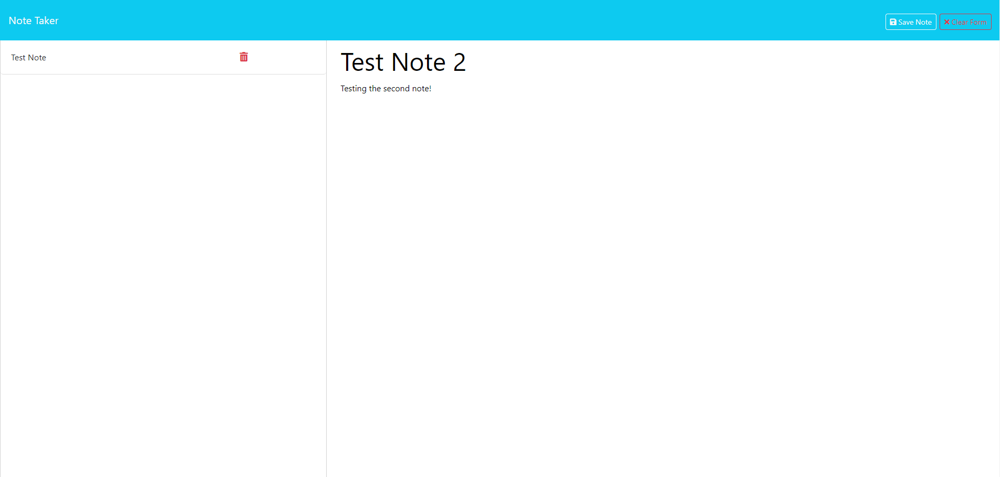

# NOTE_ME

## Description

The Note Taker Application is designed for small business owners who need a simple yet effective way to write, save, and organize their notes and tasks. With a clean interface and intuitive navigation, users can easily jot down their thoughts, keep track of important tasks, and maintain a structured overview of their notes.

## Table of Contents

- [Installation](#installation)
- [Usage](#usage)
- [Features](#features)
- [License](#license)

## Installation

To install the Note Taker Application, follow these steps:

1. Clone the repository to your local machine:
   
```
git clone https://github.com/BrandBlood97/NOTE_ME
```

2. Navigate to the application directory:
```
cd NOTE_ME
```

3. Install the required packages:
```
npm install
```

4. Start the application:
```
npm start
```


The application will be running on `http://localhost:3000`.

## Usage

Upon launching the Note Taker Application, users are greeted with a landing page that includes a link to the notes page. Here's how to use the app:

- **Starting the App:** Click on the link to the notes page to begin.
- **Viewing Notes:** Existing notes are listed on the left-hand side of the page.
- **Adding a Note:** Enter a new note title and text in the right-hand column.
- **Saving a Note:** Click "Save Note" to save your note. It will then appear with other existing notes.
- **Editing a Note:** Click on any existing note to view and edit it on the right-hand side.
- **Creating a New Note:** Either "Clear Form" or save your current note to make a new one.

## Features

- **Landing Page:** Easy access to the notes page from the initial screen.
- **Note Listing:** All saved notes are conveniently listed on the left-hand side.
- **Note Editing:** Select a note to edit its content on the right-hand side.
- **Save and New Note Buttons:** Handy buttons for saving new notes and starting fresh ones.
- **Persistent Storage:** Notes are saved and will persist between sessions.

---
### Note Page:


## License

This project is licensed under the MIT License - see the [LICENSE.md](LICENSE.md) file for details.
